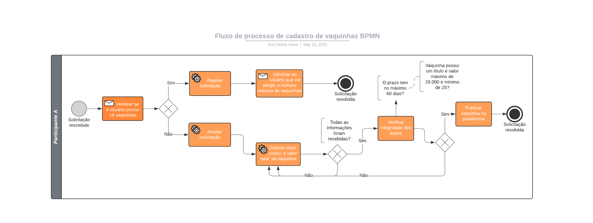

<div align="center">
      <h1></h1>
      
    <h1></h1>
    <p>Doarte API</p>    
    <hr />    
    <p>        <a href="https://www.typescriptlang.org/"></a>
               <a href="https://nlw4moveit-p6fhlbbtu-brunosampaiodev.vercel.app/">
        <a href=""></a>
    </p>     
       <hr />
</div>

## 💻 Project

Doarte Api is an application that consists on serving the Doarte-app.

This project was developed during the Bootcamp Resilia + Stone.

<br>

## ✨ Technologies

This project was developed with the following technologies:

- [Javascript](https://www.typescriptlang.org/)
- [Node.js](https://ethereal.email/)
- [Sequelize](https://typeorm.io/#/)
- [Express](https://expressjs.com/pt-br/)
- [Docker](https://jestjs.io/)
- [Postgress](https://www.beekeeperstudio.io/)

## 🔶 BPMN


<br>

# Requeriments

- [Git](https://git-scm.com/) installed
- [Docker](https://www.docker.com/) installed
- [Node](https://node.js.org/) installed
- Npm or [Yarn](https://yarnpkg.com/) installed

<br>

## 🚀 How to run

```
# Clone this repository
$ https://github.com/anvitrola/doarte-api

# Install dependencies
$ npm install

# Create image POSTGRES
$ docker-compose up

# Start the project
$ npm start
```

The application can be accessed at [`localhost:3333`](http://localhost:3333).

---

## Contributors

- [Ana Vitória Viana](https://github.com/anvitrola)

- [Elivelton Souza](https://github.com/EliveltonSouzaDev)

- [Rafael Almeida](https://github.com/RafaelVi)

- [Peter Helder](https://github.com/petersilvahs)

---

<br>

<div align="center">
  <h1>Open Source</h1>
  <sub>Copyright © 2021</sub>
  <p>DOARTE API<a href="https://github.com/anvitrola/doarte-app/blob/responsiveness/LICENSE"> is MIT licensed</a></p>
  
</div>
