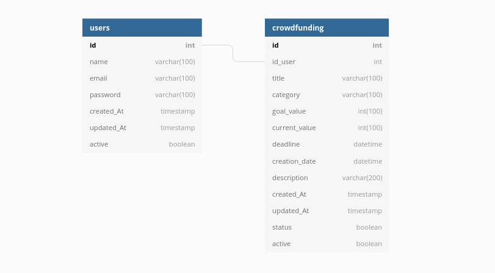

      <h1></h1>
      
    <h1></h1>
    <h3>Doarte API</h3>    
    
    
    
        
               <a href="https://nlw4moveit-p6fhlbbtu-brunosampaiodev.vercel.app/">
        
    
     
       

## 💻 Sobre o projeto

    O DOARTE: A Arte de Doar surgiu de um desafio proposto pela empresa <b>Stone</b> para a turma <b>T4 Resilia + Stone</b>. O objetivo era a construção de uma plataforma na qual usuários pudessem se cadastrar e criar vaquinhas com causas sociais a fim de arrecadar recursos. 

    Cabe destacar que o produto é <b>uma mera simulação do que seria uma aplicação real</b>. Portanto, aqui não se aplica transações bancárias e o que é transacionado são moedas fictícias. 

         

Nossa api possui a arquitetura REST e atualmente pode realizar as operações CRUD de usuários e vaquinhas (ou outro produto).</a>.
    Para visualizar o projeto há duas opções:
    <ul>
    <li>Copie esse link: 
https://doarte-api.herokuapp.com/
 e interaja com nossa API através de uma aplicação front-end ou programas como Postman ou Insomnia. 🔗 (versão instável)</li>
    <li>Para rodá-la localmente em sua máquina leia atentamente o fim desse arquivo 😉.</li>
   <ul>

         
        

     

## 🌙 Possibilidades de um usuário médio na aplicação

- [x] Cadastrar um usuário
- [x] Login na conta do usuário
- [x] Atualizar as informações ou deletar seu usuário
- [x] Cadastrar uma vaquinha
- [x] Atualizar as informações ou deletar sua vaquinha
- [x] Doar para outras vaquinhas

## 🛠 Tecnologias

O projeto foi desenvolvido utlizando as seguintes tecnologias:

- [Javascript](https://developer.mozilla.org/pt-BR/docs/Web/JavaScript)
- [Node.js](https://nodejs.org/en/)
- [Sequelize](https://sequelize.org/)
- [Express](https://expressjs.com/pt-br/)
- [Docker-Compose](https://docs.docker.com/compose/)
- [Postgress](https://www.postgresql.org/)

 

## 🔶 Diagrama da estrutura do nosso banco de dados

 

# Requerimentos para rodar aplicação localmente

- [Git](https://git-scm.com/) installed
- [Docker](https://www.docker.com/) installed
- [Node](https://node.js.org/) installed
- [Npm](https://www.npmjs.com/) or [Yarn](https://yarnpkg.com/) installed
- Além disto é bom ter um editor para trabalhar com o código como [VSCode](https://code.visualstudio.com/)

### 🐙Rodando o projeto

#### 1️⃣ Clone este repositório
$ git clone <https://github.com/anvitrola/doarte-api>

#### 2️⃣ Acesse a pasta do projeto no terminal/cmd
$ cd doarte-app

#### 3️⃣ Abra o editor de texto (VSCode)
$ code .

#### 4️⃣ Abra um novo terminal e instale as dependências
$ npm install

#### 5️⃣ Suba o banco da aplicação através desse comando 
$ docker-compose up

#### 6️⃣️ Divida o terminal em dois usando o comando Ctrl+Shift+5 ou o menu com 3 pontos no lado direito.

#### 7️⃣ Execute a aplicação no segundo terminal
$ npm start

#### 8️⃣ O servidor inciará na porta:3000 - acesse <http://localhost:3000> 

---

## 🛣️ Rotas da nossa API:

### ⚠️ Rotas que precisam que você esteja logado necessitam do header 'x-access-token' 
### com o valor do seu token (recebido após o login ser bem sucedido). 

### Autenticação

#### 🚧 /auth/signUp
Rota para cadastrar um usuário.
Verbo:POST.
Precisa estar logado:Não.

#### 🚧 /auth/signIn
Rota para autenticar e logar um usuário.
Verbo:POST.
Precisa estar logado:Não.

### Usuário

#### 🚧 /all
Rota para verificar a lista de usuários.
Verbo:GET.
Precisa estar logado:Não.

#### 🚧 /user
Rota para retornar informações do usuário.
Verbo:GET.
Precisa estar logado:Sim.

#### 🚧 /user/update
Rota para atualizar as informações do usuário.
Verbo:PATCH.
Precisa estar logado:Sim.

#### 🚧 /user/delete
Rota para deletar o usuário.
Verbo:PATCH.
Precisa estar logado:Sim.

#### 🚧 /user/donation/:id
Rota para realizar uma doação á uma vaquinha.
Verbo:POST.
Precisa estar logado:Sim.
Passar o id da vaquinha como parâmetro.

### Vaquinhas

#### 🚧 /fundraiser/create
Rota para criar uma vaquinha.
Verbo:GET.
Precisa estar logado:Sim.

#### 🚧 /fundraiser/findAll
Rota para retorna todas as vaquinhas ativas do site.
Verbo:GET.
Precisa estar logado:Não.

#### 🚧 /fundraiser/findUserFundraisers/
Rota para retornar as vaquinhas do usuário.
Verbo:PATCH.
Precisa estar logado:Sim.

#### 🚧 /fundraiser/update/:id
Rota para deletar o usuário (precisa estar logado).
Verbo:PATCH.
Precisa estar logado:Sim.
Passar o id da vaquinha como parâmetro.

#### 🚧 /fundraiser/delete/:id
Rota para deletar uma vaquinha.
Verbo:POST.
Precisa estar logado:Sim.
Passar o id da vaquinha como parâmetro.

---

## Desenvolvedores responsáveis 👩🏻👨🏻👨🏻👨🏻⚜

- <table>
  <tr>
    <td align="center">
      <a href="https://github.com/anvitrola">
         
        
          <b>Ana Vitória Viana</b>
        
      </a>
    </td>    
  </tr>
</table>

<table>
  <tr>
    <td align="center">
      <a href="https://github.com/RafaelVi">
         
        
          <b>Rafael Almeida</b>
        
      </a>
    </td>    
  </tr>
</table>

<table>
  <tr>
    <td align="center">
      <a href="https://github.com/EliveltonSouzaDev">
         
        
          <b>Elivelton Souza</b>
        
      </a>
    </td>    
  </tr>
</table>

<table>
  <tr>
    <td align="center">
      <a href="https://github.com/petersilvahs">
         
        
          <b>Peter Silva</b>
        
      </a>
    </td>    
  </tr>
</table>

- [Peter Silva]()

---

 

  <h1>Open Source</h1>
    <h3>Contruibuições são bem-vindas, desde que aberto um pull request e requisitado um review dos membros da equipe.</h3>
  Copyright © 2021
  
DOARTE <a href="https://github.com/anvitrola/doarte-app/blob/responsiveness/LICENSE">is MIT licensed 💖</a>

  

